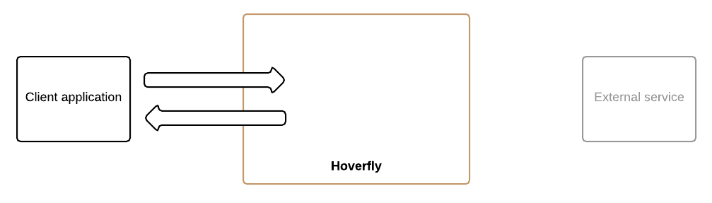

# Modes and middleware

## Hoverfly modes

Hoverfly has four modes. Detailed guides on how to use these modes are available in the **Usage** section.

### Capture mode

In this mode, Hoverfly acts as a proxy between the client application and the external service. It transparently intercepts and stores out-going requests from the client and matching incoming responses from the external service.

This is how you capture real traffic for use in development or testing.

### Simulate mode

In this mode, Hoverfly uses either previously captured traffic, or imported service data files to mimic the external service.

This is useful if you are developing or testing an application that needs to talk to an external service that you don't have reliable access to. You can use the Hoverfly "surrogate" instead of the real service.

### Synthesize mode

In this mode, Hoverfly doesn't use any stored request/response pairs. Instead, it generates responses to incoming requests on the fly and returns them to the client. This mode is dependent on *middleware* (see below) to generate the responses.

This is useful if you can't (or don't want to) capture real traffic, or if you don't want to write service data files.

### Modify mode

In this mode, Hoverfly passes requests through from the client to the server, and passes the responses back. However, it also executes middleware on the requests and responses.

This is useful for all kinds of things such as manipulating the data in requests and/or responses on the fly.

## Middleware

Middleware can be written in any language, as long as that language is supported by the Hoverfly host. For example, you could write middleware in Go, Python or JavaScript (if you have Go, Python or NodeJS installed on the Hoverfly host, respectively).

Middleware is applied to the requests and/or the responses depending on the mode:

* Capture Mode: middleware affects only outgoing requests
* Simulate Mode: middleware affects only responses (cache contents remain untouched)
* Synthesize Mode: middleware creates responses
* Modify Mode: middleware affects requests and responses

Middleware can be used to do many useful things, such as simulating network latency or failure, rate limits or controlling data in requests and responses.

A detailed guide on how to use middleware is available in the **Usage** section.