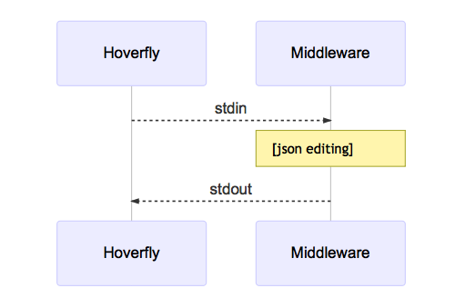

.. _middleware:

Middleware
==========

Middleware intercepts traffic between the client and the API (whether real or simulated), and allowing you to manipulate it.

You can use middleware to manipulate data in simulated responses, or to inject unpredictable performance characteristics into your simulation.

Middleware works differently depending on the Hoverfly mode.

- Capture mode: middleware affects only **outgoing requests**
- Simulate mode: middleware affects only **incoming responses** (cache contents remain untouched)
- Synthesize mode: middleware **creates responses**
- Modify mode: middleware affects **requests and responses**

You can write middleware in any language as long as it can be executed by the shell on the Hoverfly host. Middleware could be a binary file, or a script.

Middleware Interface
~~~~~~~~~~~~~~~~~~~~

When middleware is called by Hoverfly, it expects to receive and return JSON (see :ref:`simulation_schema`). Middleware can be used to modify the values in the JSON but **must not** modify the schema itself.

Hoverfly will send the JSON object to middleware via the standard input stream. Hoverfly will then listen to the standard output stream and wait for the JSON object to be returned.

.. seealso::

    Middleware examples are covered in the tutorials section. See :ref:`randomlatency` and :ref:`modifyingresponses`.
