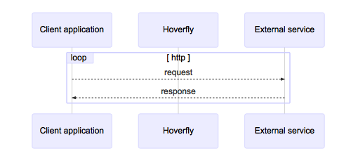

.. _capture_mode:

Capture mode
============

Capture mode is used for creating API simulations.

.. note::

    Hoverfly cannot be set to Capture mode when running as a webserver (see :ref:`webserver`).

In Capture mode, Hoverfly (running as a proxy server - see :ref:`proxy_server`) intercepts communication 
between the client application and the external service. It transparently records outgoing requests from 
the client and the incoming responses from the service API.

Most commonly, requests to the external service API are triggered by running automated tests against the 
application that consumes the API. During subsequent test runs, Hoverfly can be set to run in 
:ref:`simulate_mode`, removing the dependency on the real external service API. Alternatively, requests 
can be generated using a manual process.

Usually, Capture mode is used as the starting point in the process of creating an API simulation. Captured 
data is then exported and modified before being re-imported into Hoverfly for use as a simulation.

By default, Hoverfly will overwrite duplicate requests if the request has not changed. This can be a problem
when trying to capture a stateful endpoint that may return a different response each time you make a request.

Using the stateful mode argument when setting Hoverfly to capture mode will disable this duplicate overwrite
feature, enabling you to capture sequences of responses and play them back in :ref:`simulate_mode` in order.

.. seealso::

  This functionality is best understood via a practical example: see :ref:`capturingsequences` in the :ref:`tutorials` section.