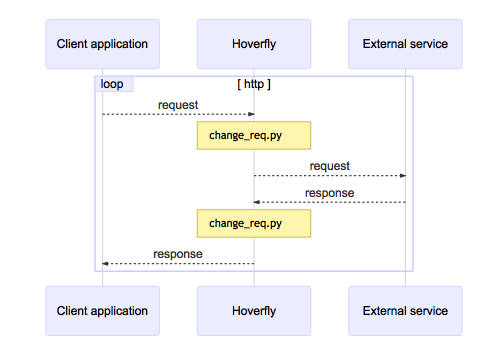

.. _modify_mode:

Modify mode
===========

Modify mode is similar to :ref:`capture_mode`, except it **does not save the requests and responses**.
In Modify mode, Hoverfly will pass each request to a :ref:`middleware` executable before forwarding
it to the destination. Responses will also be passed to middleware before being returned to the client.

You could use this mode to “man in the middle” your own requests and responses. For example, you could
change the API key you are using to authenticate against a third-party API.
