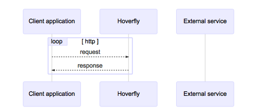

.. _simulate_mode:

Simulate mode
=============

In this mode, Hoverfly uses traffic captured using :ref:`capture_mode` (which may also have been manually edited) to mimic external APIs.

Each time Hoverfly receives a request from the application, instead of forwarding it to the intended destination, it looks in the simulation data for a matching response. If it finds a match, it returns the response to the application.

This simple matching strategy won’t always be appropriate however. In some cases you may want Hoverfly to return a single response for a number of different possible requests. This can be done by editing the simulation data (see :ref:`templates`).
