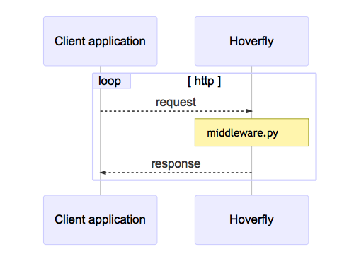

Synthesize Mode
~~~~~~~~~~~~~~~

This mode is similar to simulate mode, but instead of looking for a response in stored simulation data, the request is passed directly to a user-supplied executable file. These files are known as “middleware”.

In synthesize mode, the :term:`middleware` executable is expected to generate a response to the incoming request on the fly. Hoverfly will then return the generated response to the application. For Hoverfly to operate in synthesize mode, a middleware executable must be specified. 

.. note::
    You might use this mode to simulate an API that may be too difficult to record correctly via capture mode. An example would be an API that uses state to change the responses. You could create middleware that manages this state and produces the desired response based on the data in the request.
