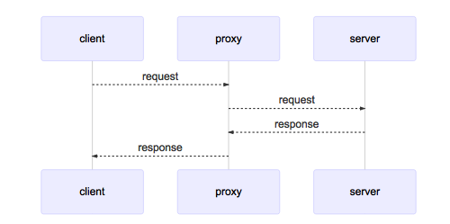
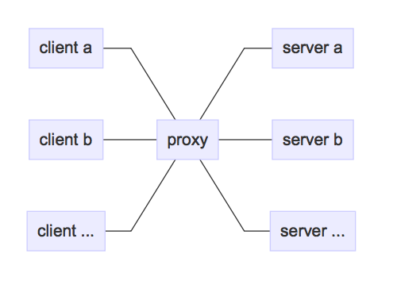

.. _proxy_server:

Hoverfly as a proxy server
==========================

A proxy server passes requests between a client and server.

It is sometimes necessary to use a proxy server to reach a network (as a security measure, for example). 
Because of this, all network-enabled software can be configured to use a proxy server.

The relationship between clients and servers via a proxy server can be one-to-one, one-to-many, 
many-to-one, or many-to-many.

By default Hoverfly starts as a proxy server.

Using a proxy server
~~~~~~~~~~~~~~~~~~~~

Applications can usually be configured to use a proxy server by setting environment variables:

.. code:: bash

    export HTTP_PROXY="http://proxy-address:port"
    export HTTPS_PROXY="https://proxy-address:port"

Launching network-enabled software within an environment containing these variables *should* make the application use the specified proxy server. The term *should* is used as not all software respects these environment variables for security reasons.

Alternatively, applications themselves can usually be configured to use a proxy. `Curl <https://curl.haxx.se/>`_ can be configured to use a proxy via flags.

.. code:: bash

    curl http://hoverfly.io --proxy http://proxy-ip:port

.. note::

    The proxy configuration methods described here are intended to help you use the code examples in this documentation. The method of configuring an application or operating system to use a proxy varies depending on the environment.

      - `Windows Proxy Settings Explained <https://www.securelink.be/windows-proxy-settings-explained/>`_
      - `Firefox Proxy Settings <https://support.mozilla.org/en-US/kb/advanced-panel-settings-in-firefox#w_connection>`_

The difference between a proxy server and a webserver
~~~~~~~~~~~~~~~~~~~~~~~~~~~~~~~~~~~~~~~~~~~~~~~~~~~~~~

A proxy server is a type of webserver. The main difference is that when a webserver recieves a request from a client, it is expected to respond with whatever the intended response is (an HTML page, for example). The data it responds with is generally expected to reside on that server, or within the same network.

A proxy server is expected to pass the incoming request on to another server (the "destination"). It is also expected to set some appropriate headers along the way, such as `X-Forwarded-For <https://en.wikipedia.org/wiki/X-Forwarded-For>`_, `X-Real-IP <https://en.wikipedia.org/wiki/X-Real-IP>`_, `X-Forwarded-Proto <https://en.wikipedia.org/wiki/X-Forwarded-Proto>`_ etc. Once the proxy server receives a response from the destination, it is expected to pass it back to the client.

.. raw:: html

    
