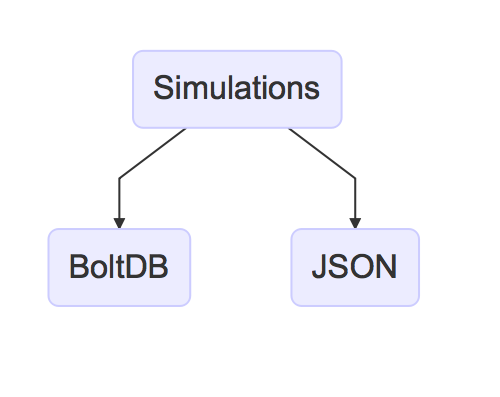

.. _simulations:

Simulations
===========

The core functionality of Hoverfly is to capture HTTP(S) traffic to create API simulations which can be used in testing. Hoverfly stores captured traffic as `simulations`. 

Simulations can be written to disk in two different formats: in a `JSON <https://en.wikipedia.org/wiki/JSON>`_, or a `BoltDB database <https://github.com/boltdb/bolt>`_ format.

<simulation>.json
.................

Simulation JSON can be exported, edited and imported in and out of Hoverfly, and can be shared among Hoverfly users or instances. Simulation JSON files must adhere to the Hoverfly :ref:`simulation_schema`.

.. seealso::

    For a hands-on tutorial of creating and editing simulations, see :ref:`simulations_io`.

requests.db
...........

Hoverfly can also store simulation data on disk in a file called `requests.db`. This file is written to the current working directory. This means simulations do not need to be manually exported and re-imported between Hoverfly invocations.

.. warning::
    Please note although you can persist the Hoverfly data store to disk, Hoverfly does not store all of its internal state in this database currently. The only way to access, modify and share the full state of a running instance of Hoverfly is through the simulation JSON.

This mechanism uses a very high performance Golang database system: `BoltDB <https://github.com/boltdb/bolt>`_.
