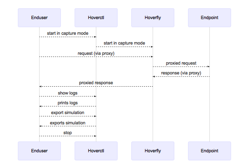

.. _simulations_io:

Creating and exporting a simulation
===================================

.. note::
   If you are running Hoverfly on a machine that accesses the internet via a proxy
   (for example if you are on a corporate network), please follow the :ref:`behind_a_proxy`
   tutorial before proceeding.

Start Hoverfly and set it to Capture mode

.. code:: bash

    hoverctl start
    hoverctl mode capture

Make a request with cURL, using Hoverfly as a proxy server:

.. code:: bash

    curl --proxy http://localhost:8500 http://time.jsontest.com    

View the Hoverfly logs

.. code:: bash

    hoverctl logs

Export the simulation to a JSON file

.. code:: bash

    hoverctl export simulation.json

Stop hoverfly

.. code:: bash

    hoverctl stop

You'll now see a ``simulation.json`` file in your current working directory, which contains all your simulation data.

In case you are curious, the sequence diagram for this process looks like this:

.. note::
   By default, request headers are not captured. If you want to capture headers, you will need to specify them when setting capture mode.

   .. code:: bash

      hoverctl mode capture --headers "User-Agent,Content-Type,Authorization"
      hoverctl mode capture --all-headers

.. note::
   It is possible to filter and export simulation to separate JSON files by providing a plain text or regex string to the ``--url-pattern`` flag:

   .. code:: bash

      hoverctl export echo.json --url-pattern "echo.jsontest.com"     // export simulations for echo.jsontest.com only
      hoverctl export api.json --url-pattern "(.+).jsontest.com"      // export simulations for all jsontest.com subdomains
